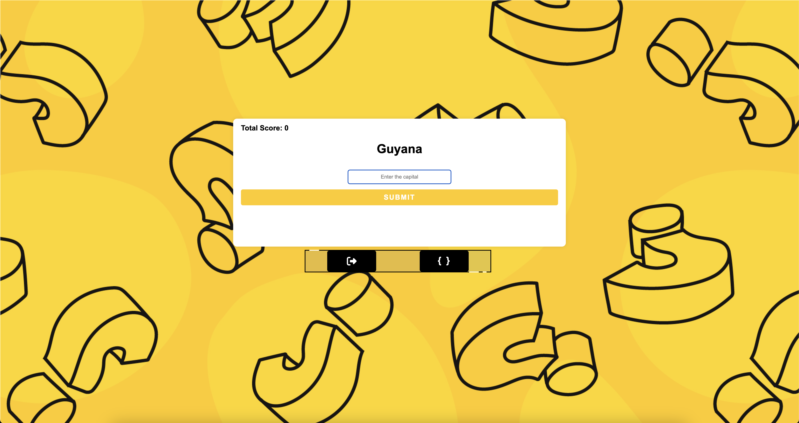

# Capital Quiz

[](#)
> An interactive quiz game where users test their knowledge of world capitals.

## Overview

**Capital Quiz** is a web-based game that challenges users to match countries with their respective capitals. A country is randomly selected from a MySQL database, and users must enter the corresponding capital. Each correct answer increases the score, making it an engaging and educational experience.

## Preview

<p align="center">
  
</p>

## Features

- **Randomized Capital Quiz:** Users must input the correct capital for a randomly selected country.
- **Database Integration:** Capital-country pairs are retrieved dynamically from a MySQL database.
- **Scoring System:** Tracks correct answers and updates the total score.
- **Simple UI:** Clean and intuitive interface for a smooth user experience.

## Live Demo

**Explore the live version here:** [View Live Demo](https://marius-bogdan.com/projects/capital-quiz/)

## Local Setup

1. **Clone** the repository:
   ```bash
   git clone https://github.com/MIBogdan/capital-quiz.git
   ```
2. **Import the database:** 
- Import the `country_capitals` file into MySQL. This will automatically create the `country_capitals` database and populate it with the necessary data.


3. **Ensure your MySQL credentials match the following** (as used in `index.js`):
- **Username**: `root`
- **Host**: `localhost`
- **Database**: `country_capitals`
- **Password**: (leave empty if not set)


4. **Install** dependencies:
   ```bash
   npm install
   ```

5. **Run** the application:
   ```bash
   npm start
   ```
- The development server will open automatically in your default browser.
- **If it doesn't open automatically**,manually visit: http://localhost:3000 in your browser.

6. **Terminate** the server:
- **On macOS/Linux:** Press `Control + C` in the terminal. 
- **On Windows:** Press `Ctrl + C` in the Command Prompt or PowerShell. 
---

## Author

**Marius Bogdan**  
[Personal portfolio](https://marius-bogdan.com/)

Feel free to reach out for any questions or collaborations!

## License

This project is provided for testing and demonstration purposes only. All rights are reserved. No part of this project may be redistributed, reuploaded, or used in any manner (commercially or otherwise) without explicit written permission from the author.
